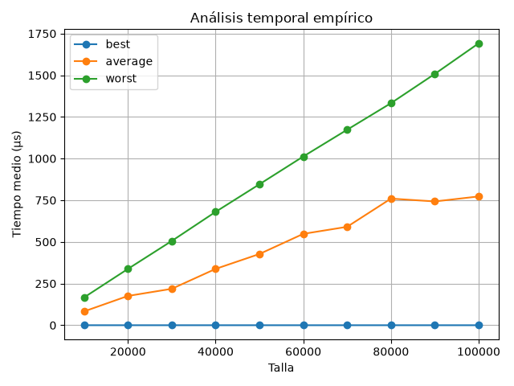
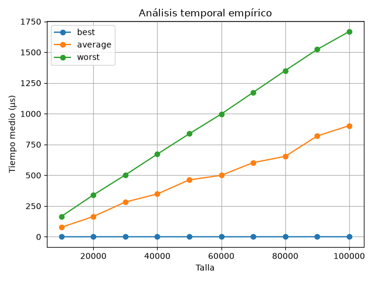
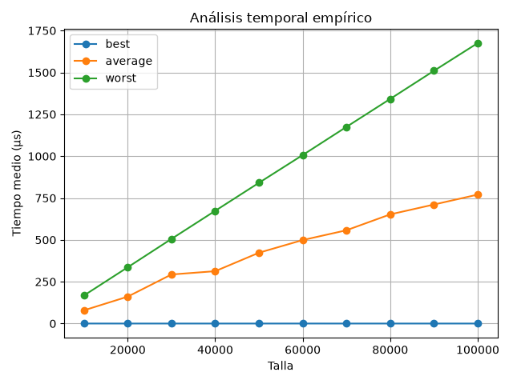

---
layout:
  width: wide
  title:
    visible: true
  description:
    visible: true
  tableOfContents:
    visible: true
  outline:
    visible: true
  pagination:
    visible: true
  metadata:
    visible: true
  tags:
    visible: true
  actions:
    visible: true
---

# Análisis empírico de la complejidad temporal de la búsqueda lineal

Ya disponemos de todas las piezas necesarias: la implementación del algoritmo de búsqueda lineal, junto con sus generadores de parámetros para los casos mejor, peor y promedio, y nuestra herramienta genérica de análisis de tiempos. Ahora vamos a ensamblar estas piezas en un único script.

***

## Actividad 8: Implementando el script de análisis

En la raíz del directorio de la práctica (`p3`), crea un archivo llamado `analyse_linear_search.py`.

Este archivo servirá de script principal o punto de entrada. Aquí debes:

1. Importar la clase `TimeAnalysis` de tu paquete `complexity`.
2. Importar la función `linear_search` y sus tres generadores del módulo `linear_search` del paquete `algorithms`.
3. Instanciar `TimeAnalysis` con ellos.
4. Generar una lista de tallas (`sizes`) desde 10.000 hasta 100.000, con incrementos de 10.000.
5. Ejecutar el método `run()` pasándole la lista de tallas y 100 repeticiones.
6. Imprimir los resultados por consola usando el método `show_table()`.
7. Generar y guardar en un archivo PDF la gráfica de resultados, invocando `plot()`.
8. Generar y mostrar por pantalla la gráfica, también con `plot()`.

Una vez implementado, ejecuta el script desde tu terminal:

```bash
python analyse_linear_search.py
```

Después de unos segundos (o minutos, dependiendo de la potencia de tu ordenador), deberías obtener por consola una salida parecida a la siguiente:

<details>

<summary>Salida esperada</summary>


```bash
Análisis temporal: búsqueda lineal
Tallas       : [10000, 20000, 30000, 40000, 50000, 60000, 70000, 80000, 90000, 100000]
Repeticiones : 100

Midiendo tiempos... (puede tardar varios minutos)
Lanzando mediciones para el caso mejor.
Medición para talla 10000
Medición para talla 20000
Medición para talla 30000
Medición para talla 40000
Medición para talla 50000
Medición para talla 60000
Medición para talla 70000
Medición para talla 80000
Medición para talla 90000
Medición para talla 100000
Lanzando mediciones para el caso promedio.
Medición para talla 10000
Medición para talla 20000
Medición para talla 30000
Medición para talla 40000
Medición para talla 50000
Medición para talla 60000
Medición para talla 70000
Medición para talla 80000
Medición para talla 90000
Medición para talla 100000
Lanzando mediciones para el caso peor.
Medición para talla 10000
Medición para talla 20000
Medición para talla 30000
Medición para talla 40000
Medición para talla 50000
Medición para talla 60000
Medición para talla 70000
Medición para talla 80000
Medición para talla 90000
Medición para talla 100000

Tabla de tiempos (μs):
        best  average  worst
Talla                       
10000    0.3    313.6  613.5
20000    0.3    641.2 1232.6
30000    0.3    822.5 1859.3
40000    0.3   1368.2 2525.5
50000    0.3   1442.9 3107.0
60000    0.3   1891.4 3734.0
70000    0.3   2432.9 4373.9
80000    0.3   2665.2 5005.2
90000    0.3   2841.1 5629.8
100000   0.3   3591.3 6276.2

Guardando gráfica del análisis temporal en 'linear_search.pdf'
Mostrando gráfica del análisis temporal
```


</details>


Evidentemente, tus tiempos de ejecución pueden diferir enormemente, ya que dependen de las capacidades del entorno de ejecución. Lo que no puede diferir es la tasa de crecimiento, como razonamos a continuación.


En cuanto a la gráfica generada, debería tener un aspecto similar a estas:

<div><figure><figcaption></figcaption></figure> <figure><figcaption></figcaption></figure> <figure><figcaption></figcaption></figure></div>


Si observas mucho "ruido" en las mediciones (lo verás claramente en la gráfica), prueba a aumentar el número de repeticiones a 1000 o incluso 10000.


Comprueba visualmente que la gráfica obtenida se corresponde de forma empírica con las predicciones del análisis teórico:

* **Caso peor:** Comportamiento claramente lineal $$\Theta(n)$$.
* **Caso promedio:** Comportamiento lineal, pero con una pendiente aproximada a la mitad que la del caso peor $$\Theta(n/2) \in \Theta(n)$$.
* **Caso mejor:** Comportamiento constante $$\Theta(1)$$.
