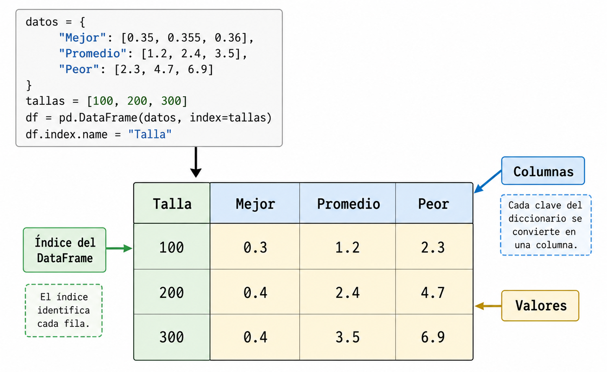

# Construyendo y mostrando tablas de tiempos con la librería pandas

Una vez que hemos medido los tiempos del algoritmo, la forma más habitual de presentar los datos recolectados es a través de una **tabla**, donde cada fila se corresponde con la talla del problema analizado y las columnas con los tiempos medidos (en la unidad escogida) para cada uno de los casos significativos evaluados.

Para representar y dibujar estructuras tubulares en Python de forma robusta y sencilla, usaremos la potente librería [**pandas**](https://pandas.pydata.org/).

### Ejemplo de generación de tabla de tiempos con `pandas`

Abre una terminal interactiva de Python tecleando `python3` y reproduce el siguiente ejemplo.

Primero, importaremos la librería:

```python
import pandas as pd
```

Supongamos que hemos medido los tiempos de la búsqueda lineal para las tallas `[100, 200, 300]` y disponemos de las listas con los promedios en nanosegundos resultantes para los casos mejor, promedio y peor.

Construiremos un **diccionario** cuyas claves sean los encabezados de las columnas (el caso a evaluar) y los valores sean listas correspondientes a los **microsegundos** resultantes. Recuerda que para pasar de nanosegundos a microsegundos debemos dividir entre `1000.0`.

```python
# Tiempos medidos en nanosegundos (ficticios para este ejemplo)
tallas = [100, 200, 300]
tiempos_mejor = [350, 355, 360]
tiempos_promedio = [1200, 2400, 3500]
tiempos_peor = [2300, 4700, 6900]

# Preparamos el diccionario dividiendo entre 1000.0
datos = {
    "Mejor": [t / 1000.0 for t in tiempos_mejor],
    "Promedio": [t / 1000.0 for t in tiempos_promedio],
    "Peor": [t / 1000.0 for t in tiempos_peor]
}
```

A continuación, crearemos un objeto de tipo **`DataFrame`** de pandas. A este objeto le proporcionaremos tanto el diccionario `datos` como el índice por el que se deben clasificar las filas (en nuestro caso, las `tallas`). Finalmente, también proporcionaremos un nombre al índice:

```python
df = pd.DataFrame(datos, index=tallas)
df.index.name = "Talla"
```

Por último, podemos imprimir el `DataFrame` por pantalla. Además, el método `.to_string()` nos permite establecer reglas de formato, de manera que podemos usar una función anónima `lambda` para forzar a que todos los números se muestren exclusivamente con **un único decimal**:

```python
print("Tabla de tiempos (μs):")
print(df.to_string(float_format=lambda x: f"{x:.1f}"))
```

Si todo ha ido bien, obtendrás en tu terminal de Python una salida idéntica a esta:

```bash
Tabla de tiempos (μs):
       Mejor  Promedio  Peor
Talla                       
100      0.3       1.2   2.3
200      0.4       2.4   4.7
300      0.4       3.5   6.9
```

Como puedes observar, la librería `pandas` alinea y formatea las columnas de forma automática y transparente.

<figure><figcaption></figcaption></figure>
