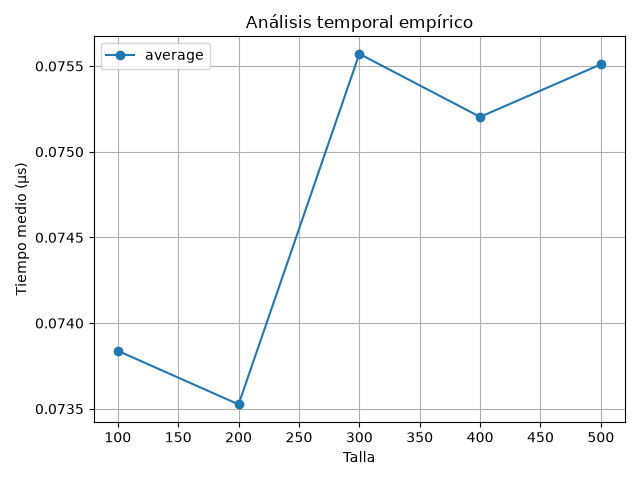
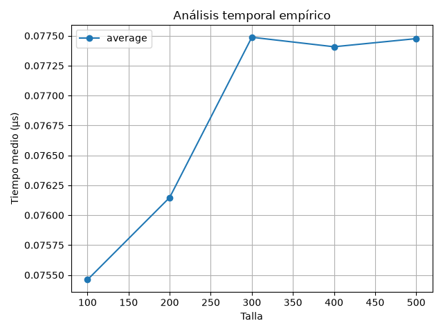
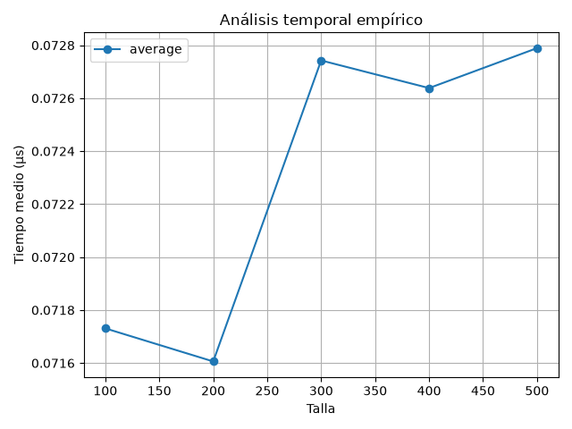

---
layout:
  width: wide
  title:
    visible: true
  description:
    visible: true
  tableOfContents:
    visible: true
  outline:
    visible: true
  pagination:
    visible: true
  metadata:
    visible: true
  tags:
    visible: true
  actions:
    visible: true
---

# El paquete complexity y el módulo time\_analysis

Siguiendo nuestra organización en módulos, definiremos un paquete llamado `complexity` en el directorio de la práctica (`p3`), donde aglutinaremos todas las utilidades relacionadas de forma genérica con la evaluación de algoritmos. En él se ubicará un módulo `time_analysis` con una clase homónima.

### Clase `TimeAnalysis` <a href="#clase-timeanalysis" id="clase-timeanalysis"></a>

Esta clase actuará de "analizador temporal empírico". Su responsabilidad es doble: por un lado, gestionar toda la infraestructura de la medición repetida de tiempos en base al algoritmo y las funciones generadoras que se le proporcionen; por otro lado, gestionar la presentación de los resultados ya sea de forma tabular o gráfica, haciendo uso de `pandas` y `matplotlib`.

<table><thead><tr><th width="189.21875">Nombre</th><th width="149.71875">Tipo</th><th width="123.5">Visibilidad</th><th>Descripción</th></tr></thead><tbody><tr><td><code>algorithm</code></td><td>de instancia</td><td>privado</td><td>Función <em>callable</em> del algoritmo a analizar.</td></tr><tr><td><code>case_generator</code></td><td>de instancia</td><td>privado</td><td>Función <em>callable</em> generadora de parámetros de la función <code>algorithm</code> para el caso único.</td></tr><tr><td><code>best_generator</code></td><td>de instancia</td><td>privado</td><td>Función <em>callable</em> generadora de parámetros de la función <code>algorithm</code> para el caso mejor.</td></tr><tr><td><code>average_generator</code></td><td>de instancia</td><td>privado</td><td>Función <em>callable</em> generadora de parámetros de la función <code>algorithm</code> para el caso promedio.</td></tr><tr><td><code>worst_generator</code></td><td>de instancia</td><td>privado</td><td>Función <em>callable</em> generadora de parámetros de la función <code>algorithm</code> para el caso peor.</td></tr><tr><td><code>sizes</code></td><td>de instancia</td><td>privado</td><td>Lista de enteros con las tallas procesadas en la última ejecución.</td></tr><tr><td><code>times</code></td><td>de instancia</td><td>privado</td><td><p>Diccionario donde las claves son los identificadores del caso (<code>"best"</code>, <code>"average"</code> o <code>"worst"</code>) y los valores son listas con los tiempos medios en nanosegundos correspondientes a cada talla.</p><h4 id="metodos"><br></h4></td></tr></tbody></table>

### Métodos

La clase ofrecerá **métodos getter en forma de propiedades de solo lectura para todos los atributos privados**, excepto `sizes` y `times`.

Además de dichas propiedades, la clase implementará los siguientes métodos:

<table><thead><tr><th width="229.203125">Perfil</th><th width="134.1640625">Tipo</th><th width="90.30859375">Visibilidad</th><th>Descripción</th></tr></thead><tbody><tr><td><code>__init__(algorithm, *, case_generator=None, best_generator=None, average_generator=None, worst_generator=None)</code></td><td>Constructor de instancia</td><td>-</td><td><p>Inicializa la instancia configurando los atributos privados de solo lectura correspondientes y valida la combinación de parámetros recibida. </p><p></p><p>Lanza <code>ValueError</code> si se incumple alguna regla: </p><p>- Si se define <code>case_generator</code> a la vez que algún otro generador. </p><p>- Si se define <code>average_generator</code> sin proporcionar también el <code>best_generator</code> y el <code>worst_generator</code>. </p><p>- Si se proporciona <code>best_generator</code> pero falta <code>worst_generator</code>, o viceversa. - Si no se proporciona al menos un <code>case_generator</code> o el par <code>best_generator</code>+<code>worst_generator</code>.</p><p></p><p> <code>sizes</code> y <code>times</code> se inicializarán a lista vacía y diccionario vacío, respectivamente. </p><p></p><p>Notad que el tipo de análisis que se realizará (caso único o casos significativos) dependerá de los parámetros proporcionados al constructor.</p></td></tr><tr><td><code>run(sizes, repetitions=1000)</code></td><td>De instancia</td><td>Público</td><td><p>Prepara los atributos <code>__sizes</code> y <code>__times</code> e invoca a <code>__measure()</code> para medir el coste de los casos que corresponda medir para cada una de las tallas indicadas en <code>sizes</code>, guardando los resultados del tiempo medio en el diccionario interno.</p><p></p><p>Los tiempos del caso único o del caso promedio se almacenarán en la clave de diccionario <code>"average"</code>, mientras que los del caso mejor y peor se almacenarán bajo las claves <code>"best"</code> y <code>"worst"</code>, respectivamente.</p></td></tr><tr><td><code>show_table()</code></td><td>De instancia</td><td>Público</td><td><p>Construye un <code>DataFrame</code> de <code>pandas</code> y lo imprime por pantalla tabulado, mostrando los tiempos resultantes en microsegundos (μs). <a href="construyendo-y-mostrando-tablas-de-tiempos-con-la-libreria-pandas.md">Consulta aquí</a> para ver un ejemplo y más detalles. </p><p></p><p>Lanza <code>RuntimeError</code> si se invoca antes de que existan datos en <code>__times</code> (es decir, antes de invocar a <code>run()</code>).</p></td></tr><tr><td><code>plot(filename=None)</code></td><td>De instancia</td><td>Público</td><td><p>Construye las gráficas de tiempo usando <code>matplotlib.pyplot</code>. Si el parámetro opcional <code>filename</code> tiene un valor distinto de <code>None</code>, se guardará la gráfica en disco usando dicho nombre. En caso contrario, se mostrará interactivamente usando <code>plt.show()</code>. <a href="construyendo-y-mostrando-tablas-de-tiempos-con-la-libreria-pandas.md">Consulta aquí</a> para ver un ejemplo y más detalles. </p><p></p><p>Lanza <code>RuntimeError</code> si se invoca antes de que existan datos en <code>__times</code>.</p></td></tr><tr><td><code>measure(generator, repetitions, gen_params_once=False)</code></td><td>De instancia</td><td>Privado</td><td><p>Método <strong>privado</strong> que realiza las mediciones de tiempo para el algoritmo usando la función generadora de parámetros <code>generator</code> .</p><p></p><p>Para cada talla, repite el proceso de generar parámetros y medir tiempos la cantidad de veces especificada por <code>repetitions</code>, y <strong>devuelve una lista</strong> con los tiempos promedios en nanosegundos (un promedio por cada talla). <a href="construyendo-y-mostrando-tablas-de-tiempos-con-la-libreria-pandas.md">Consulta aquí</a> para ver un ejemplo y más detalles. </p><p></p><p>Notad que, para los casos deterministas (mejor y peor) los parámetros deben generarse <em>una sola vez</em> por talla (cuando <code>gen_params_once=True</code>, mientras que para los probabilistas (promedio / único) deben regenerarse en cada repetición (cuando <code>gen_params_once=False</code>).</p><h3 id="actividad-6-creacion-del-paquete-complexity"><br></h3></td></tr></tbody></table>

***

## Actividad 6: Creación del paquete complexity

Al igual que hicimos con el paquete `algorithms`, vamos a crear el paquete `complexity` en el que se encontrará el módulo `time_analysis` con la implementación de la clase `TimeAnalysis`. Es buena práctica exponer la API pública de nuestro paquete en el fichero `__init__.py`.

Crea el directorio `complexity`, y a continuación, crea con vim el fichero `complexity/__init__.py` y exporta explícitamente la clase `TimeAnalysis`:

```python
from .time_analysis import TimeAnalysis

__all__ = [
    'TimeAnalysis',
]
```

***

## Actividad 7: Implementación y depuración de la clase `TimeAnalysis`

Implementa la clase `TimeAnalysis` en el fichero (módulo) `complexity/time_analysis.py`.

Una vez lo tengas implementado, añade el siguiente fragmento de pruebas al final del fichero de tu módulo `time_analysis.py`:


**NO MODIFICAR ESTE BLOQUE DE CÓDIGO PRINCIPAL**

Su salida se podrá usar el día del examen para evaluaros.


<details>

<summary>Código de test</summary>


```python
if __name__ == "__main__":
    import sys

    def dummy_alg(*args):
        pass

    def dummy_gen(n):
        return (n,)

    print("Probando validaciones...")
    try:
        TimeAnalysis(dummy_alg, case_generator=dummy_gen, best_generator=dummy_gen)
    except ValueError as e:
        print(f"  > ValueError OK: {e}")

    try:
        TimeAnalysis(dummy_alg, best_generator=dummy_gen)
    except ValueError as e:
        print(f"  > ValueError OK: {e}")

    try:
        TimeAnalysis(dummy_alg)
    except ValueError as e:
        print(f"  > ValueError OK: {e}")

    try:
        analysis = TimeAnalysis(
            dummy_alg,
            best_generator=dummy_gen,
            average_generator=dummy_gen,
            worst_generator=dummy_gen
        )
        print("  > Creación de clase con tres casos OK")
    except Exception as e:
        print(f"  > OJOOOOO! Error inesperado, revísalo: {e}")
        sys.exit()

    print("\nProbando show_table sin datos previos...")
    try:
        analysis.show_table()
    except RuntimeError as e:
        print(f"  > RuntimeError OK: {e}")

    print("\nProbando plot sin datos previos...")
    try:
        analysis.plot()
    except RuntimeError as e:
        print(f"  > RuntimeError OK: {e}")

    print("\nProbando run con tres casos...")
    analysis.run([100, 200, 300, 400, 500], repetitions=10000)

    print("\nProbando show_table...")
    analysis.show_table()

    try:
        analysis = TimeAnalysis(
            dummy_alg,
            case_generator=dummy_gen
        )
        print("  > Creación de clase con un solo caso OK")
    except Exception as e:
        print(f"  > OJOOOOO! Error inesperado, revísalo: {e}")
        sys.exit()

    print("\nProbando run con un solo caso...")
    analysis.run([100, 200, 300, 400, 500], repetitions=1000000)

    print("\nProbando show_table...")
    analysis.show_table()

    print("\nProbando plot...")
    analysis.plot()

    print("\nProbando plot guardando a fichero 'prueba.pdf'...")
    analysis.plot(filename='prueba.pdf')
```


</details>

Ejecuta el módulo para comprobar las validaciones de tu implementación:


```bash
python -m complexity.time_analysis
```


Deberás obtener un comportamiento donde todas las excepciones han sido correctamente capturadas, equivalente a esto:

<details>

<summary>Salida esperada</summary>


```python
Probando validaciones...
  > ValueError OK: case_generator es incompatible con best_generator, average_generator y worst_generator.
  > ValueError OK: Si se proporciona best_generator, también debe proporcionarse worst_generator.
  > ValueError OK: Debe proporcionarse al menos case_generator o la pareja best_generator + worst_generator.
  > Creación de clase con tres casos OK

Probando show_table sin datos previos...
  > RuntimeError OK: No hay mediciones. Ejecuta run() primero.

Probando plot sin datos previos...
  > RuntimeError OK: No hay mediciones. Ejecuta run() primero.

Probando run con tres casos...
Lanzando mediciones para el caso mejor.
Medición para talla 100
Medición para talla 200
Medición para talla 300
Medición para talla 400
Medición para talla 500
Lanzando mediciones para el caso promedio.
Medición para talla 100
Medición para talla 200
Medición para talla 300
Medición para talla 400
Medición para talla 500
Lanzando mediciones para el caso peor.
Medición para talla 100
Medición para talla 200
Medición para talla 300
Medición para talla 400
Medición para talla 500

Probando show_table...
Tabla de tiempos (μs):
       best  average  worst
Talla                      
100     0.2      0.2    0.2
200     0.2      0.2    0.2
300     0.2      0.2    0.2
400     0.2      0.2    0.2
500     0.2      0.2    0.2
  > Creación de clase con un solo caso OK

Probando run con un solo caso...
Lanzando mediciones para el caso único.
Medición para talla 100
Medición para talla 200
Medición para talla 300
Medición para talla 400
Medición para talla 500

Probando show_table...
Tabla de tiempos (μs):
       average
Talla         
100        0.2
200        0.2
300        0.2
400        0.2
500        0.2

Probando plot...

Probando plot guardando a fichero 'prueba.pdf'...
```


</details>


Notad que estamos midiendo tiempos de una función que no hace nada (`pass`). En la gráfica estamos observando con bastante detalle el ruido de las mediciones de tiempo de dicha función, de coste constante.


<div><figure><figcaption></figcaption></figure> <figure><figcaption></figcaption></figure> <figure><figcaption></figcaption></figure></div>
