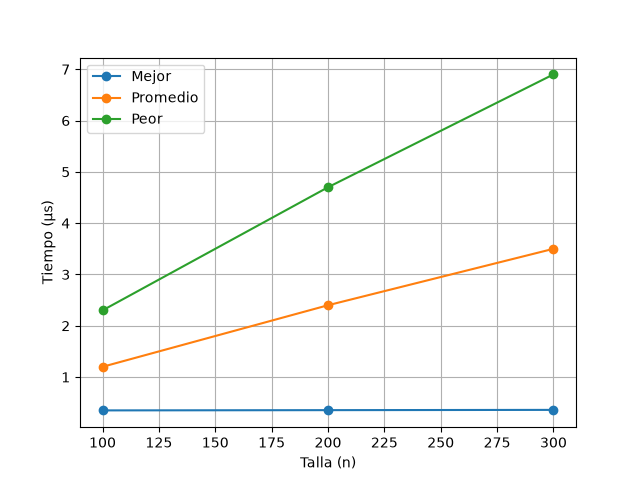
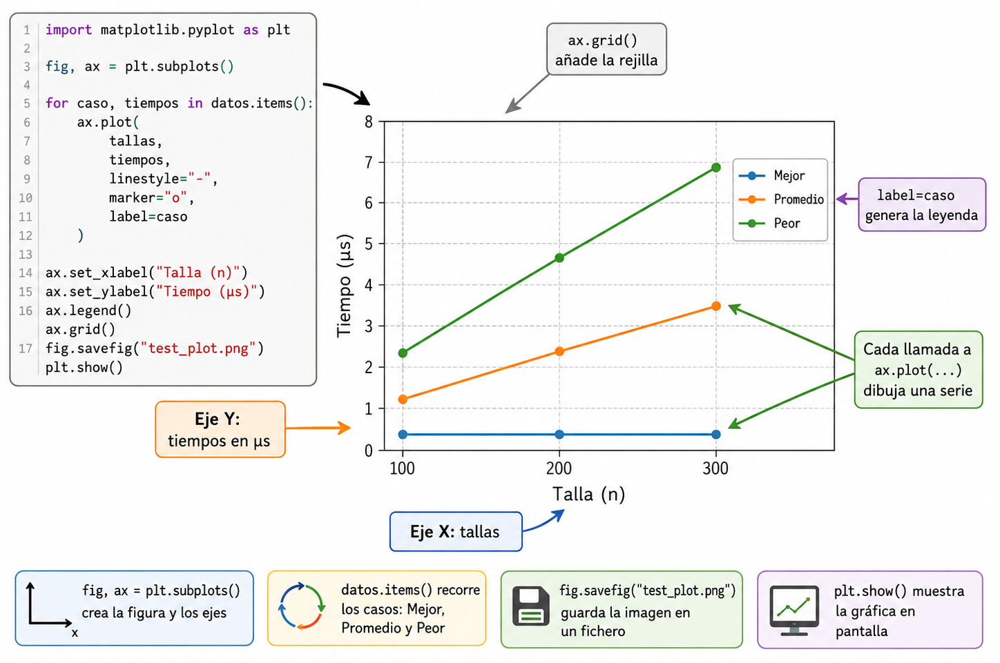

# Generando gráficas de tiempo con matplotlib

Además de mostrar las tablas con resultados, la forma más reveladora de evaluar el coste temporal de un algoritmo empíricamente es generando una gráfica que represente la evolución del tiempo en relación a la talla del problema. Para ello, usaremos la librería estándar de representación de datos de Python: [**matplotlib**](https://matplotlib.org/).

### Ejemplo de generación de gráficas de tiempo <a href="#ejemplo-de-generacion-de-graficas-de-tiempo" id="ejemplo-de-generacion-de-graficas-de-tiempo"></a>

Continuando en la misma sesión interactiva del ejemplo de uso de la librería pandas anterior (en la que tenías definidos la lista de `tallas` y el diccionario `datos` con los tiempos de cada caso), importa la librería `matplotlib` con el alias típico `plt`:

```python
import matplotlib.pyplot as plt
```

Vamos a proceder a crear nuestra figura y ejes iniciales, para posteriormente, usar un bucle que los recorra e invoque a la función `ax.plot(...)` trazando así las tres series de forma superpuesta:

```python
# Inicializamos el entorno de la figura
fig, ax = plt.subplots()

# Iteramos sobre nuestro diccionario de datos, para obtener los tiempos para cada caso
for caso, tiempos in datos.items():
    ax.plot(
        tallas,               # Eje X: Tallas
        tiempos,              # Eje Y: Tiempos en microsegundos
        linestyle="-",        # Estilo de línea continua
        marker="o",           # Marcadores circulares en los datos medidos
        label=caso            # Etiqueta de la leyenda (Mejor, Promedio, Peor)
    )
```

Por último, procederemos a añadir la leyenda y formatear un poco la presentación general de los ejes:

```python
# Etiquetado de los ejes
ax.set_xlabel("Talla (n)")
ax.set_ylabel("Tiempo (μs)")

# Añadimos la leyenda y la rejilla
ax.legend()
ax.grid()
```

Llegados a este punto, la gráfica se encuentra almacenada en la memoria, dentro del objeto `fig`. Ahora podemos decidir si queremos mostrarla interactivamente en pantalla o guardarla directamente en un fichero:

```python
# Para guardar la figura en formato PNG (también podrías usar .pdf)
fig.savefig("test_plot.png")
plt.close() # liberar memoria

# Para mostrarla en una ventana interactiva
plt.show()
```

Comprueba que en el directorio local de trabajo ha aparecido el fichero `test_plot.png`.&#x20;

Al abrirlo, observarás el resultado empírico y visual de los tiempos en cada uno de los casos.

<figure><figcaption></figcaption></figure>

#### Infografía

<figure><figcaption></figcaption></figure>
